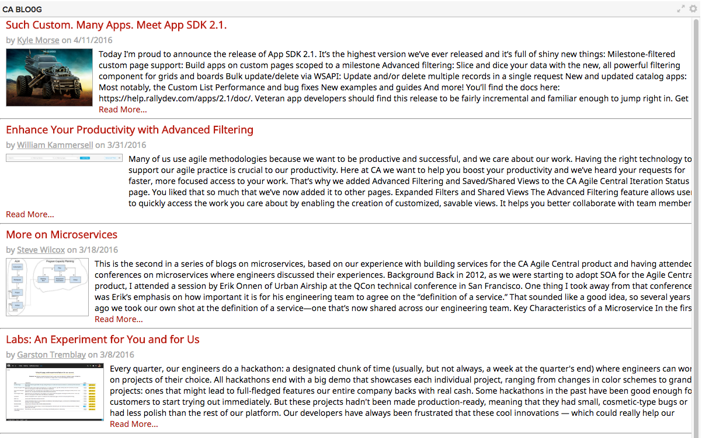

# CA Agile Blog
A CA Agile Central App to show users the latest news and announcements from CA Agile (formerly Rally). This app pulls the RSS feed from http://rallydev.com/blog and displays it in a visual format for easy consumption:

## Background
This app was created during the 2016.Q1 CA Hackathon. Its goal is to promote CA's agile expertise and product news in an easily digestable format on the dashboard.

## Features
Using the RSS feed from the blog at rallydev.com, the app shows each post's title, author, date, description, and a thumbnail of the first image in the article (if applicable). There are links to view the post and/or the author. Posts that were created in the last 3 days are marked with a special red background behind the title.

## Extensibility
You can use this app as a base for your own app that transforms RSS/XML to HTML, and could even tweak it to consume a differen blog. If you do use a different blog, you may need to ensure the blog is hosted via HTTPS (to avoid cross-site scripting) and has access policies that allow Javascript from CA Agile Central.